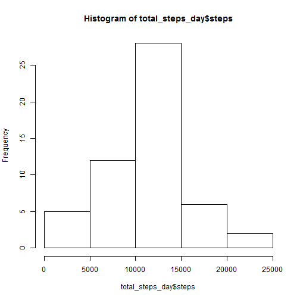
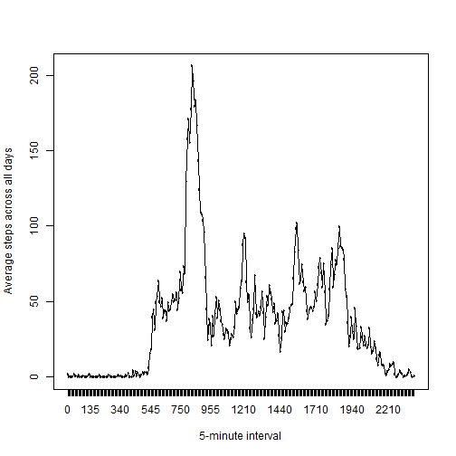
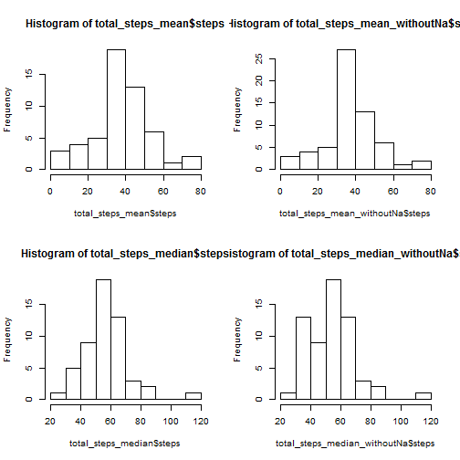

```r
setwd("D:/Projects/Analytics/CourseEra/DataScience/05_ReproducibleResearch/Proj1")

library(knitr)
library(ggplot2)
#library(reshape2)

Data <- read.csv("activity.csv",  header=TRUE) # stringsAsFactors=FALSE, , na.strings = "?", dec = "."
str(Data)
```

```
## 'data.frame':	17568 obs. of  3 variables:
##  $ steps   : int  NA NA NA NA NA NA NA NA NA NA ...
##  $ date    : Factor w/ 61 levels "2012-10-01","2012-10-02",..: 1 1 1 1 1 1 1 1 1 1 ...
##  $ interval: int  0 5 10 15 20 25 30 35 40 45 ...
```

```r
nrow(Data)
```

```
## [1] 17568
```

```r
names(Data)
```

```
## [1] "steps"    "date"     "interval"
```

```r
head(Data)
```

```
##   steps       date interval
## 1    NA 2012-10-01        0
## 2    NA 2012-10-01        5
## 3    NA 2012-10-01       10
## 4    NA 2012-10-01       15
## 5    NA 2012-10-01       20
## 6    NA 2012-10-01       25
```

```r
#1.  Calculate the total number of steps taken per day
total_steps_day <- aggregate(steps ~ date, data= Data, FUN= sum,na.rm = T)
head(total_steps_day)
```

```
##         date steps
## 1 2012-10-02   126
## 2 2012-10-03 11352
## 3 2012-10-04 12116
## 4 2012-10-05 13294
## 5 2012-10-06 15420
## 6 2012-10-07 11015
```

```r
#2.  Make a histogram of the total number of steps taken each day
hist(total_steps_day$steps)
```

 

```r
#3.  Calculate and report the mean and median of the total number of steps taken per day
total_steps_mean <- aggregate(steps  ~ date,data= Data, FUN= mean,na.rm = T)
head(total_steps_mean)
```

```
##         date    steps
## 1 2012-10-02  0.43750
## 2 2012-10-03 39.41667
## 3 2012-10-04 42.06944
## 4 2012-10-05 46.15972
## 5 2012-10-06 53.54167
## 6 2012-10-07 38.24653
```

```r
Data_after_zero_na <- subset(Data, is.na(steps) == FALSE & steps > 0)
total_steps_median <- aggregate(steps  ~ date,data= Data_after_zero_na, FUN=median,na.rm = T)
head(total_steps_median)
```

```
##         date steps
## 1 2012-10-02  63.0
## 2 2012-10-03  61.0
## 3 2012-10-04  56.5
## 4 2012-10-05  66.0
## 5 2012-10-06  67.0
## 6 2012-10-07  52.5
```

```r
#1. Make a time series plot (i.e. type = "l") of the 5-minute interval (x-axis) and the average number of steps taken, averaged across all days (y-axis)
Data$intervalFac <- as.factor(Data$interval)

total_steps_mean_acrossDays <- aggregate(steps  ~ intervalFac,data= Data, FUN=mean,na.rm = T)
head(total_steps_mean_acrossDays)
```

```
##   intervalFac     steps
## 1           0 1.7169811
## 2           5 0.3396226
## 3          10 0.1320755
## 4          15 0.1509434
## 5          20 0.0754717
## 6          25 2.0943396
```

```r
dim(total_steps_mean_acrossDays)
```

```
## [1] 288   2
```

```r
plot(x = total_steps_mean_acrossDays$intervalFac, y = total_steps_mean_acrossDays$steps, type = "l", xlab = "5-minute interval", ylab = "Average steps across all days")
lines(x = total_steps_mean_acrossDays$intervalFac, y = total_steps_mean_acrossDays$steps)
```

 

```r
#2.  Which 5-minute interval, on average across all the days in the dataset, contains the maximum number of steps?
total_steps_mean_acrossDays[total_steps_mean_acrossDays$steps == max(total_steps_mean_acrossDays$steps),]
```

```
##     intervalFac    steps
## 104         835 206.1698
```

```r
# 1.  Calculate and report the total number of missing values in the dataset (i.e. the total number of rows with NAs)
at_least_one_NA <- is.na(Data$steps)
head(which(at_least_one_NA == T))
```

```
## [1] 1 2 3 4 5 6
```

```r
length(which(at_least_one_NA == T))
```

```
## [1] 2304
```

```r
#2.Devise a strategy for filling in all of the missing values in the dataset. The strategy does not need to be sophisticated. For example, you could use 
#the mean/median for that day, or the mean for that 5-minute interval, etc.

naRows <- which(at_least_one_NA == T)

#sapply(naRows, function(row) Data[row,]$steps <- total_steps_mean_acrossDays[ total_steps_mean_acrossDays$intervalFac == Data[row,]$intervalFac,]$steps)

for (row in naRows)
{
  Data[row,]$steps <- total_steps_mean_acrossDays[ total_steps_mean_acrossDays$intervalFac == Data[row,]$intervalFac,]$steps
}

#Testing
at_least_one_NA2 <- is.na(Data$steps)
length(which(at_least_one_NA2 == T))
```

```
## [1] 0
```

```r
#3.  Create a new dataset that is equal to the original dataset but with the missing data filled in.

head(Data)
```

```
##       steps       date interval intervalFac
## 1 1.7169811 2012-10-01        0           0
## 2 0.3396226 2012-10-01        5           5
## 3 0.1320755 2012-10-01       10          10
## 4 0.1509434 2012-10-01       15          15
## 5 0.0754717 2012-10-01       20          20
## 6 2.0943396 2012-10-01       25          25
```

```r
#4.	Make a histogram of the total number of steps taken each day and Calculate and report the mean and median total number of steps taken per day. 
#Do these values differ from 
total_steps_mean_withoutNa <- aggregate(steps  ~ date,data= Data, FUN= mean)

Data_after_zero_na <- subset(Data, is.na(steps) == FALSE & steps > 0)
total_steps_median_withoutNa <- aggregate(steps  ~ date,data= Data_after_zero_na, FUN=median)

head(total_steps_median_withoutNa)
```

```
##         date    steps
## 1 2012-10-01 37.45283
## 2 2012-10-02 63.00000
## 3 2012-10-03 61.00000
## 4 2012-10-04 56.50000
## 5 2012-10-05 66.00000
## 6 2012-10-06 67.00000
```

```r
head(Data)
```

```
##       steps       date interval intervalFac
## 1 1.7169811 2012-10-01        0           0
## 2 0.3396226 2012-10-01        5           5
## 3 0.1320755 2012-10-01       10          10
## 4 0.1509434 2012-10-01       15          15
## 5 0.0754717 2012-10-01       20          20
## 6 2.0943396 2012-10-01       25          25
```

```r
str(Data)
```

```
## 'data.frame':	17568 obs. of  4 variables:
##  $ steps      : num  1.717 0.3396 0.1321 0.1509 0.0755 ...
##  $ date       : Factor w/ 61 levels "2012-10-01","2012-10-02",..: 1 1 1 1 1 1 1 1 1 1 ...
##  $ interval   : int  0 5 10 15 20 25 30 35 40 45 ...
##  $ intervalFac: Factor w/ 288 levels "0","5","10","15",..: 1 2 3 4 5 6 7 8 9 10 ...
```

```r
par(mfrow = c(2,2))
hist(total_steps_mean$steps)
hist(total_steps_mean_withoutNa$steps)

hist(total_steps_median$steps)
hist(total_steps_median_withoutNa$steps)
```

 

```r
#Are there differences in activity patterns between weekdays and weekends?

#1.  Create a new factor variable in the dataset with two levels - "weekday" and "weekend" indicating whether a given date is a weekday or weekend day.
db <- Data

ty <- sapply(as.Date(Data$date), function(date) {ifelse(weekdays(date) %in% c("Saturday","Sunday"),c("weekend"), c("weekday"))})
ty <- factor(x = ty,levels=c("weekend","weekday"))
head(ty)
```

```
## [1] weekday weekday weekday weekday weekday weekday
## Levels: weekend weekday
```

```r
Data$DateType <- ty
head(Data)
```

```
##       steps       date interval intervalFac DateType
## 1 1.7169811 2012-10-01        0           0  weekday
## 2 0.3396226 2012-10-01        5           5  weekday
## 3 0.1320755 2012-10-01       10          10  weekday
## 4 0.1509434 2012-10-01       15          15  weekday
## 5 0.0754717 2012-10-01       20          20  weekday
## 6 2.0943396 2012-10-01       25          25  weekday
```

```r
str(Data)
```

```
## 'data.frame':	17568 obs. of  5 variables:
##  $ steps      : num  1.717 0.3396 0.1321 0.1509 0.0755 ...
##  $ date       : Factor w/ 61 levels "2012-10-01","2012-10-02",..: 1 1 1 1 1 1 1 1 1 1 ...
##  $ interval   : int  0 5 10 15 20 25 30 35 40 45 ...
##  $ intervalFac: Factor w/ 288 levels "0","5","10","15",..: 1 2 3 4 5 6 7 8 9 10 ...
##  $ DateType   : Factor w/ 2 levels "weekend","weekday": 2 2 2 2 2 2 2 2 2 2 ...
```

```r
class(Data$DateType)
```

```
## [1] "factor"
```

```r
#2.	Make a panel plot containing a time series plot (i.e. type = "l") of the 5-minute interval (x-axis) and the average number of steps taken, 
#averaged across all weekday days or weekend days (y-axis). See the README file in the GitHub repository to see an example of what this plot should 
#look like using simulated data.

total_steps_week <- aggregate(steps  ~  intervalFac + DateType ,data= Data, FUN=mean)
head(total_steps_week)
```

```
##   intervalFac DateType       steps
## 1           0  weekend 0.214622642
## 2           5  weekend 0.042452830
## 3          10  weekend 0.016509434
## 4          15  weekend 0.018867925
## 5          20  weekend 0.009433962
## 6          25  weekend 3.511792453
```

```r
table(total_steps_week$DateType)
```

```
## 
## weekend weekday 
##     288     288
```

```r
nrow(total_steps_week)
```

```
## [1] 576
```

```r
plot(x = total_steps_week$intervalFac, y = total_steps_week$steps, levels = total_steps_week$DateType,  type = "l", xlab = "5-minute interval", ylab = "Average steps")
lines(x = total_steps_week$intervalFac, y = total_steps_week$steps)

qplot(x = total_steps_week$intervalFac, y = total_steps_week$steps, facet_wrap(~total_steps_week$DateType))

gg <- ggplot(data=total_steps_week, aes(x=as.integer(intervalFac), y=steps)) +  geom_line(size = 1) 
gg <- gg + facet_grid(DateType ~ .) + facet_wrap( ~ DateType, ncol=1)
gg <- gg + xlab("5-minute interval") + ylab("Average steps")
gg
```

 
